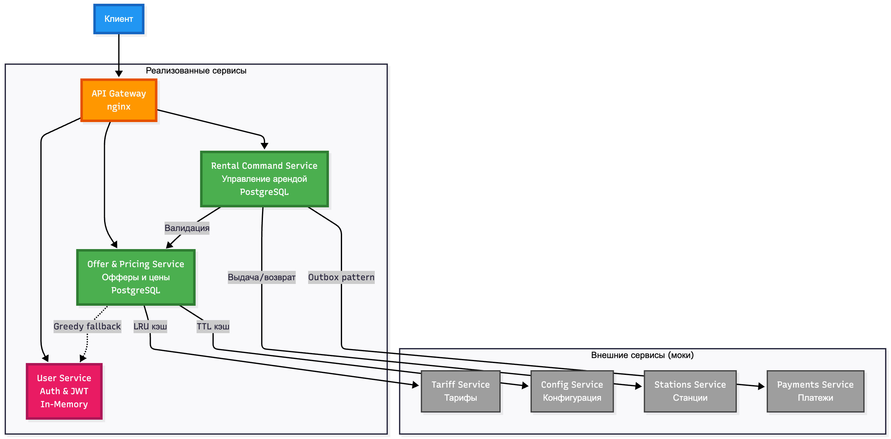

# ADR-0001: Архитектура сервиса аренды пауэрбанков (Команда 7)

### Архитектурный стиль

Выбран подход **микросервисной архитектуры с выделенными доменами и CQRS**, без жёсткой зависимости всех запросов от одного сервиса.

Ключевые сервисы:

- **API Gateway (nginx)** — единая точка входа, маршрутизирует запросы на нужный сервис.
- **Offer & Pricing Service** — отвечает за офферы и прайсинг (использует внешние tariffs, config и обращается к User Service для сегментов/статусов), самодостаточный по чтению.
- **Rental Command Service** — операции старта/завершения аренды (использует оффер и взаимодействует с внешними stations/payments). Также содержит эндпоинты для чтения арендов и текущей стоимости.
- **User Service (Auth & Profile)** — аутентификация, авторизация, профили, сегменты пользователей. Другие сервисы обращаются к нему как к единому источнику правды по пользователям.

Горячие пути разделены:
- создание оффера,
- старт/финиш аренды,
- чтение состояния аренды/стоимости — масштабируются независимо.

Внешние зависимости (мокируются или предполагаются):
- **Stations Service** — управление станциями, резервирование/выдача/возврат пауэрбанков.
- **Payments Service** — списание/возврат средств, работа через Outbox-паттерн.
- **Tariff Service** — предоставление тарифов, используется через клиент с LRU-кэшем.
- **Config Service** — централизованная конфигурация, используется через клиент с TTL-кэшем.

### Компоненты

#### API Gateway (nginx)
- Единая точка входа для всех клиентских запросов.
- Маршрутизация на внутренние сервисы.
- Терминация TLS (опционально).

#### Offer & Pricing Service
- Создание офферов с актуальными тарифами.
- Валидация и использование офферов при старте аренды.
- Контроль свежести оффера (expires_at, tariff_version).
- Хранит `offers` и `offer_audit` в PostgreSQL.
- **Fallback greedy pricing** — если при вычислении стоимости не может получить информацию от User Service (таймаут/ошибка), использует "жадный" тариф.

#### Rental Command Service
- Управляет жизненным циклом аренды (старт/финиш).
- Command endpoints: `POST /internal/rentals/start`, `POST /internal/rentals/{rental_id}/finish`.
- Query endpoints: `GET /internal/rentals/{rental_id}` — чтение аренды и текущей стоимости.
- Хранит `rentals`, `rental_events`, `outbox_payments` в PostgreSQL.
- Взаимодействует с внешними Stations и Payments через HTTP API.

#### User Service (Auth & Profile)
- Аутентификация и авторизация через JWT.
- Управление профилями пользователей.
- Управление сегментами пользователей для персонализации тарифов.
- **Хранилище:** In-memory (для прототипа/демонстрации).

### Данные и хранилище

#### База данных (PostgreSQL)

#### Контроль свежести оффера
- Проверка `expires_at` и `tariff_version` при создании аренды.
- Если оффер протух — HTTP 409 и новый оффер.

#### Шардирование
- Логическое по `user_id` или `station_region`.
- Rental Service хранит mapping shard → connection.

### Нефункциональные требования

#### Maintainability
- Чёткие слои: API, Service, Domain, Repository.
- Bounded contexts, SOLID, чистая архитектура.
- Конфигурация через env.

#### Reliability
- Retry/timeout для критичных клиентов (stations, payments).
- Outbox для платежей.
- Fallback и кэш для некритичных.

#### Scalability
- Stateless Rental Service.
- Горизонтальное масштабирование.
- Read scaling через реплики БД.
- Кэширование для снижения нагрузки.

#### Integration
- Работа с stations/payments, idempotency.
- Поведение при истёкшем TTL tariffs.

#### Load
- 1000 RPS на `POST /rentals/start`.
- 100x `GET /rentals/{id}` на одну аренду.

#### Выпадение сервисов:
- Отключение users → greedy pricing.
- Отключение tariffs → ошибка.

### Развёртывание

- Docker и docker-compose.
- Prometheus + Grafana.
- Автоматические миграции БД.

## Фиксированные архитектурные решения

1. **Сетевые границы**
   - Внешние клиенты взаимодействуют только с **API Gateway**.
   - Все внутренние вызовы между сервисами идут по публичным contract-first API (HTTP/gRPC).

2. **User Service (Auth & Profile)**
   - Является **единственным источником истины по пользователям**.
   - Выдаёт JWT; остальные сервисы доверяют токену и клеймам.

3. **Greedy pricing**
   - Реализуется строго в **Offer & Pricing Service**.
   - Условие активации: таймаут или ошибка обращения к User Service при расчёте прайсинга.

4. **Tariffs / Config**
   - Tariffs и Config доступны только через соответствующие клиенты (адаптеры) с кэшем.
   - При протухании TTL для тарифов всегда возвращается ошибка; использование устаревших тарифов запрещено (тогда кидаем default).

5. **Stations / Payments**
   - Tracing-критичные зависимости для команд аренды.
   - При недоступности — операции старта аренды не выполняются.

---

## Хранилища по сервисам

### API Gateway
- **Хранилище:** нет бизнес-БД.
- **Состояние:** stateless.

### User Service (Auth & Profile)
- **Тип БД:** In-memory (для прототипа).
- **Структуры данных:**
  - `users(user_id, email, phone, password_hash, status, created_at)`
  - `user_profiles(user_id, name, extra_metadata)`
  - `user_segments(user_id, segment, updated_at)`
  - `refresh_tokens(token_id, user_id, expires_at, revoked)`
- **Особенности:**
  - Простые in-memory словари для быстрого прототипирования.
  - Данные не персистентны (теряются при перезапуске).
  - Для production потребуется миграция на PostgreSQL.

### Offer & Pricing Service
- **Тип БД:** PostgreSQL.
- **Таблицы:**
  - `offers(offer_id, user_id, station_id, tariff_snapshot_json, created_at, expires_at, status)`
  - `offer_audit(id, offer_id, event_type, ts, payload_json)`
- **Особенности:**
  - В `tariff_snapshot_json` фиксируется ставка/правила, по которым потом считается аренда.
  - `expires_at` используется для контроля свежести.
- **Репликация:**
  - 1 primary для записи, 1..N read-replicas для чтения офферов.
- **Шардирование:**
  - Логическое по `user_id`:
    - `shard = hash(user_id) mod N`.
    - Каждый шард — БД-инстанс.

### Rental Command Service
- **Тип БД:** PostgreSQL, логически отделён от Offer.
- **Таблицы:**
  - `rentals(rental_id, offer_id, user_id, station_id, started_at, finished_at, status)`
  - `rental_events(event_id, rental_id, ts, type, payload_json)`
  - `rental_cost_snapshots(rental_id, ts, cost_amount, details_json)` — агрегированные стоимости.
  - `outbox_payments(id, rental_id, operation, amount, status, payload_json, created_at)` — для интеграции с Payments.
- **Эндпоинты:**
  - Command: `POST /internal/rentals/start`, `POST /internal/rentals/{rental_id}/finish`
  - Query: `GET /internal/rentals/{rental_id}` — чтение аренды и текущей стоимости
- **Репликация:**
  - Primary для команд, read-реплики для запросов на чтение.
- **Шардирование:**
  - По `user_id`.

---

## Надежность 
--**Rental Command Service**

В случае недоступности внешних сервисов (Offer Service, Stations Adapter) или ошибки чтения/записи в репозиторий поднимаются соответствующие исключения (или общее исключение) и происходит откат БД, то есть операции происходят в рамках атомарных транзакции БД.

Если на любом этапе выполнения операции start_rental или finish_rental внешний сервис недоступен/возвращает ошибку/отвечает некорректными данными, то выбрасывается то выбрасывается соответствующее исключение (либо общее исключение уровня клиента/адаптера). Поскольку вызов находится внутри открытой транзакции, происходит полный откат транзакции БД. То есть при ошибках аренда не создаётся / не завершается / системное состояние остаётся консистентным / клиент получает ошибку уровня 4xx или 5xx (в зависимости от типа исключения).

Любая ошибка на уровне ORM/БД (например, потеря соединения, нарушение ограничений) также приводит к выбросу исключения. Поскольку операция выполняется внутри транзакции: все операции над сущностями rentals, rental_events и outbox_payments будут отменены; состояние базы данных останется неизменным. 

Операция finish_rental считается успешной только если выполнены все шаги:
чтение сущности аренды по rental_id -> проверка совпадения user_id запроса и user_id из записи в БД -> Проверка статуса аренды (ACTIVE) -> Успешный вызов Stations Adapter (return_powerbank) -> Успешное обновление записи в rentals (установка finished_at, статуса, итоговой стоимости) -> Запись события в rental_events -> Создание записи в outbox_payments
Если любая из операций завершается ошибкой, вся транзакция откатывается, то есть аренда остается в статусе ACTIVE, запись в outbox не появляется, клиент получает ошибку.

В силу использования одной транзакции на весь процесс, операции не могут быть частично применены, сервис обеспечивает ACID-корректность на уровне одного запроса, состояние всегда находится либо в исходной точке, либо полностью обновлено.

--**Offer & Pricing Service**

Сервис имеет три внешние зависимости с разными стратегиями обработки отказов:

**1. User Service (некритичная зависимость)**
- **Timeout:** 3 секунды
- **Retry:** нет (быстрый fail)
- **Fallback:** Greedy Pricing
- **Поведение при отказе:** Сервис продолжает работать, создавая офферы с максимальным тарифом (защита бизнеса от потери выручки). Клиент получает валидный оффер, но с повышенной ставкой.

**2. Tariff Service (критичная зависимость)**
- **Timeout:** 5 секунд
- **Retry:** 2 попытки с exponential backoff (1s, 2s)
- **Cache:** LRU + TTL (10 минут, размер 1000 записей)
- **Защита от амплификации:** Jittered TTL (±60 секунд) предотвращает одновременное истечение кэша
- **Поведение при отказе:** 
  - Cache HIT → сервис работает нормально (99% запросов)
  - Cache MISS + ошибка Tariff Service → HTTP 503, оффер не создаётся
  - Обоснование: нельзя использовать устаревшие тарифы (бизнес-требование)

**3. Config Service (некритичная зависимость)**
- **Timeout:** 2 секунды
- **Cache:** TTL 60 секунд с auto-refresh
- **Поведение при отказе:** Используется закэшированная конфигурация. При полном отсутствии конфига применяются дефолтные значения (offer_ttl=300s).

**Операции с БД:**
- Все операции создания/обновления офферов выполняются в рамках транзакций PostgreSQL
- При ошибке записи в БД (потеря соединения, constraint violation) транзакция откатывается
- Клиент получает HTTP 500, оффер не создаётся
- Audit log записывается в отдельной транзакции (best effort, не блокирует основную операцию)

**Валидация оффера (endpoint для Rental Service):**
- Атомарная операция: проверка статуса + обновление на USED
- Использует SELECT FOR UPDATE для предотвращения race condition (два одновременных старта аренды с одним оффером)
- При конфликте (оффер уже использован) → HTTP 409
- При отсутствии оффера → HTTP 404

**Итог:** Сервис деградирует gracefully при недоступности User Service (greedy pricing), работает из кэша при проблемах с Config, но не создаёт офферы при недоступности Tariff Service (бизнес-ограничение).

---

## Use-case потоки

Ниже описаны ключевые сценарии целиком

### 1. Аутентификация и получение токена
1. Client → **User Service**: `POST /auth/login {email, password}`.
2. User Service валидирует пользователя и возвращает:
   - `access_token` (JWT с `sub=user_id`, `segment`, `roles`).
3. Client во всех последующих запросах передаёт `Authorization: Bearer <access_token>`.

### 2. Создание оффера аренды
1. Client → **API Gateway**: `POST /offers {station_id}` + JWT.
2. Gateway валидирует JWT (через публичный ключ User Service).
3. Gateway → **Offer & Pricing Service**: `POST /internal/offers` с данными:
   - `user_id` из токена,
   - `station_id`,
   - `user_segment` из токена (если есть).
4. Offer & Pricing Service:
   - Читает актуальный config из кэша.
   - Читает tariffs через LRU-кэш; при miss — запрашивает Tariffs Service.
   - При необходимости запрашивает User Service для уточнения сегмента.
   - При недоступности User Service применяет greedy pricing.
   - Формирует `tariff_snapshot_json` и `expires_at`.
   - Создаёт запись в `offers`.
5. Ответ Gateway → Client:
   - `offer_id`, `expires_at`, описание тарифа.

### 3. Старт аренды (использование оффера)
1. Client → **API Gateway**: `POST /rentals/start {offer_id}` + JWT.
2. Gateway → **Rental Command Service**: `POST /internal/rentals/start` с данными:
   - `user_id` из токена,
   - `offer_id`.
3. Rental Command Service:
   - Читает оффер из **Offer & Pricing Service API** только через API.
   - Проверяет:
     - `expires_at >= now`,
     - статус оффера `ACTIVE`.
   - Вызывает **Stations Adapter**: `POST /stations/reserve_or_issue {station_id, user_id}`.
   - При успехе создаёт `rental` в `rentals` и событие `rental_started` в `rental_events`.
4. Ответ Gateway → Client:
   - `rental_id`, `start_time`, базовые тарифные условия.

### 4. Завершение аренды
1. Client → **API Gateway**: `POST /rentals/{rental_id}/finish {station_id}` + JWT.
2. Gateway → **Rental Command Service**.
3. Rental Command Service:
   - Валидирует, что `user_id` совпадает.
   - Вычисляет стоимость по `tariff_snapshot_json` оффера + фактическому времени.
   - Вызывает **Stations Adapter**: `POST /stations/return {station_id, rental_id}`.
   - Создаёт запись в `outbox_payments` на списание.
   - Обновляет `rentals.status = FINISHED`, пишет `rental_events`.
4. Payments процессинг (асинхронно):
   - Payments Adapter читает `outbox_payments`, вызывает внешний Payments Service.
   - При успехе помечает запись как `SENT`.
5. Ответ Gateway → Client:
   - Финальная стоимость, статус `FINISHED`.

### 5. Получение информации об аренде и текущей стоимости
1. Client → **API Gateway**: `GET /rentals/{rental_id}` + JWT.
2. Gateway → **Rental Command Service**: `GET /internal/rentals/{rental_id}` с:
   - `user_id` из токена.
3. Rental Command Service (query endpoint):
   - Проверяет владение `rental.user_id == token.user_id`.
   - Если `status = ACTIVE`:
     - Использует `tariff_snapshot` и `started_at` для расчёта `current_cost` на момент запроса.
   - Если `status = FINISHED`:
     - Возвращает сохранённую конечную стоимость.
4. Ответ:
   - `rental_id, status, station_id, started_at, finished_at, current_cost, tariff_details`.

### 6. Интеграции с внешними сервисами

#### Config Service
- Клиенты обращаются через **ConfigClient** с кэшем TTL=60s и auto-refresh.
- При истечении TTL запрашивает Config Service заново.

#### Tariff Service
- **Offer & Pricing Service** обращается через **TariffClient**:
  - LRU-кэш по ключу (station_id, tariff_type, segment).
  - TTL (по умолчанию 10 минут, конфигурируемый).
  - При истекшем TTL выполняет запрос к Tariffs Service.
  - Если запрос неуспешен → возвращает ошибку; оффер не создаётся.

#### Fallback: Greedy Pricing
- Активируется в **Offer & Pricing Service** при недоступности User Service.
- Процесс:
  1. Offer & Pricing пытается получить сегмент пользователя от User Service.
  2. При таймауте/ошибке: выбирает тариф с максимальной ставкой из доступных для данной станции.
  3. Формирует оффер на основе greedy тарифа (защита от потери выручки).

---

## Архитектура

---

## Рассмотренные альтернативы

### Архитектурный стиль

**Альтернатива: Монолитная архитектура**

**Плюсы:**
- Простота разработки (один репозиторий)
- ACID транзакции между офферами и арендами
- Быстрый старт MVP
- Проще отладка

**Минусы:**
- Невозможность независимого масштабирования (офферы создаются чаще, чем завершаются аренды)
- Единая точка отказа
- Разный профиль нагрузки: офферы (CPU-bound, кэш, внешние вызовы) vs аренды (IO-bound, транзакции)
- Сложность поддержки при росте команды

**Решение: Отклонено.** Выбрана микросервисная архитектура с разделением Offer и Rental из-за требований по независимому масштабированию (1000 RPS на старт аренды, 100x чтений) и разных SLA по доменам.

---

### Выбор базы данных

**Альтернатива 1: Managed PostgreSQL (AWS RDS, Google Cloud SQL, Azure Database)**

**Плюсы:**
- Автоматические бэкапы и point-in-time recovery
- Автоматическое масштабирование storage
- Managed репликация и failover
- Мониторинг из коробки

**Минусы:**
- Высокая стоимость для учебного проекта
- Vendor lock-in
- Сложность локальной разработки (нужны credentials, VPN)
- Для MVP избыточно

**Альтернатива 2: NoSQL (MongoDB, DynamoDB, Cassandra)**

**Плюсы:**
- Горизонтальное масштабирование "из коробки"
- Гибкая схема (tariff_snapshot как JSON без миграций)
- Высокая доступность

**Минусы:**
- Отсутствие ACID транзакций (критично для `validate_and_use_offer` — race condition)
- Сложность обеспечения консистентности (оффер ACTIVE → USED должно быть атомарным)
- Eventual consistency не подходит для критичных операций (старт аренды)
- Команда не имеет опыта с NoSQL

**Решение: Выбран self-hosted PostgreSQL в Docker.**

**Обоснование:**
- ACID транзакции для критичных операций (SELECT FOR UPDATE)
- Полный контроль и прозрачность для учебного проекта
- Простота локальной разработки (docker-compose)
- Достаточная производительность для MVP (шардирование по user_id при росте)
- Зрелая экосистема (Alembic для миграций, asyncpg для async)
- Для production можно легко мигрировать на managed решение без изменения кода

**Trade-off:** Принимаем необходимость ручного управления репликацией и бэкапами в обмен на контроль и нулевую стоимость для MVP. 
