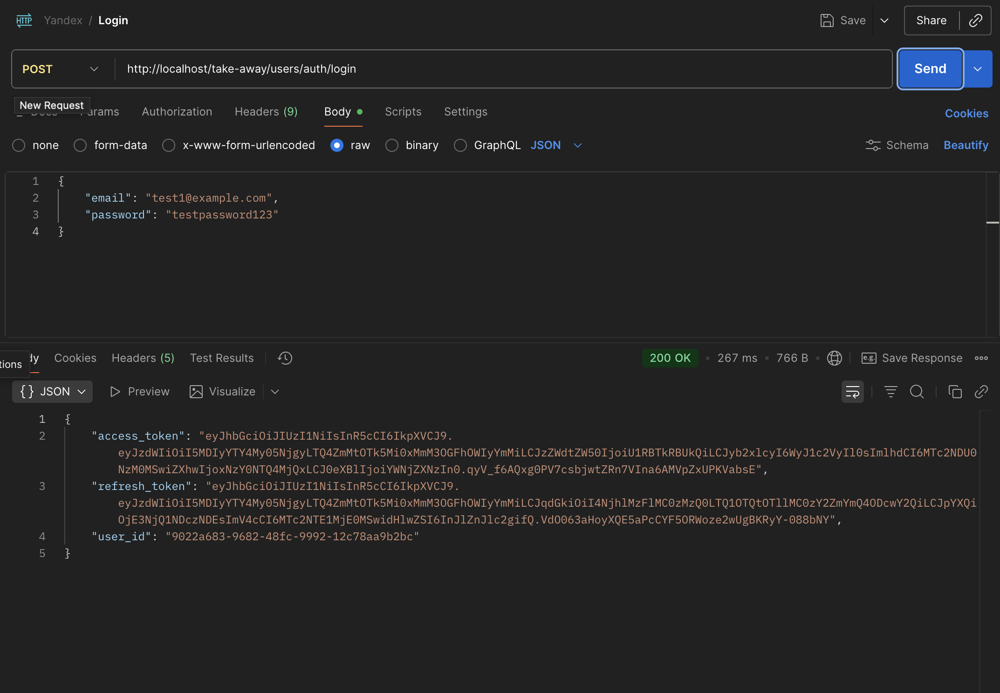
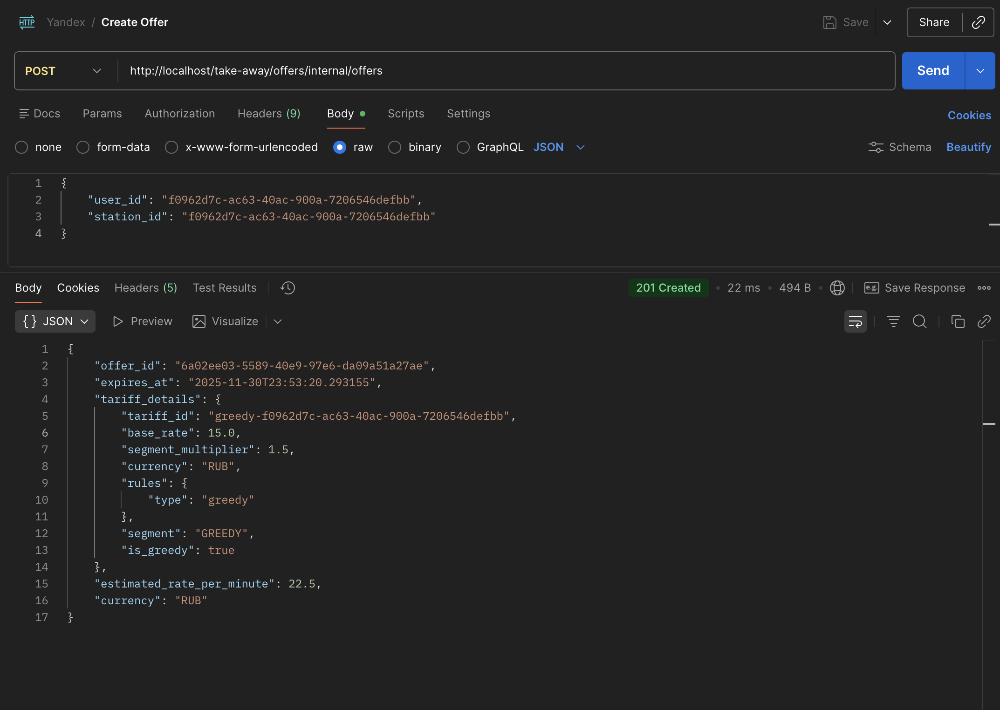
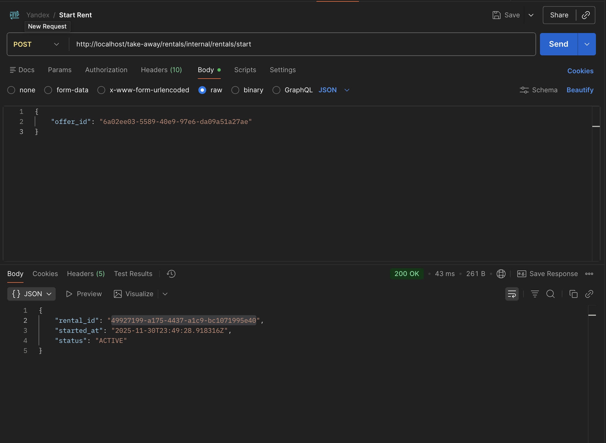
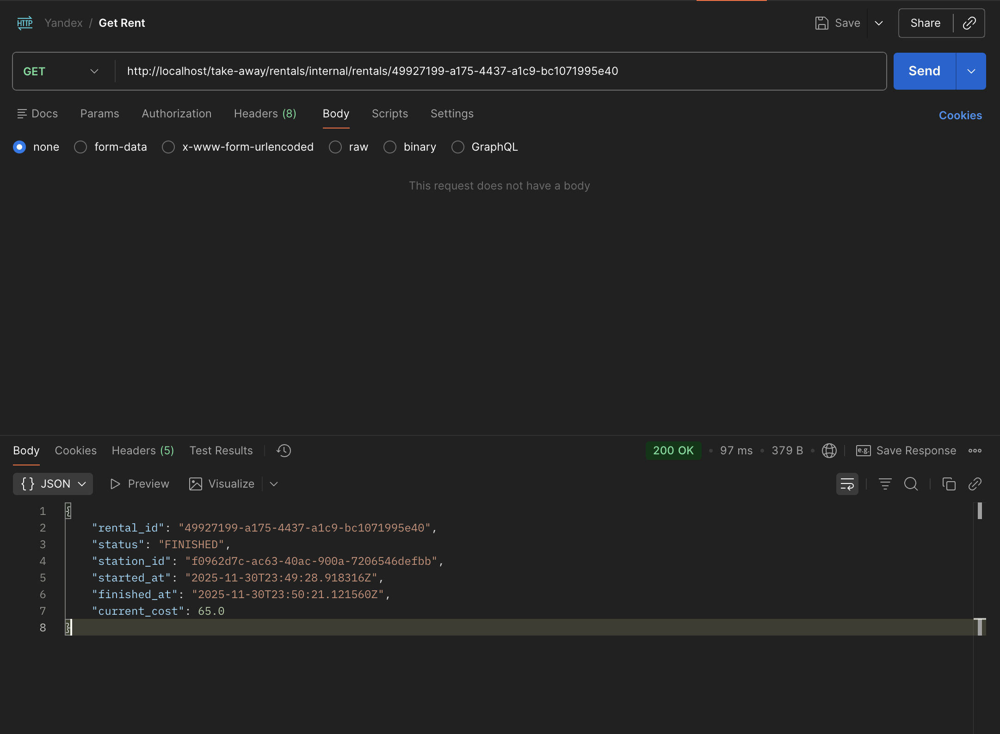
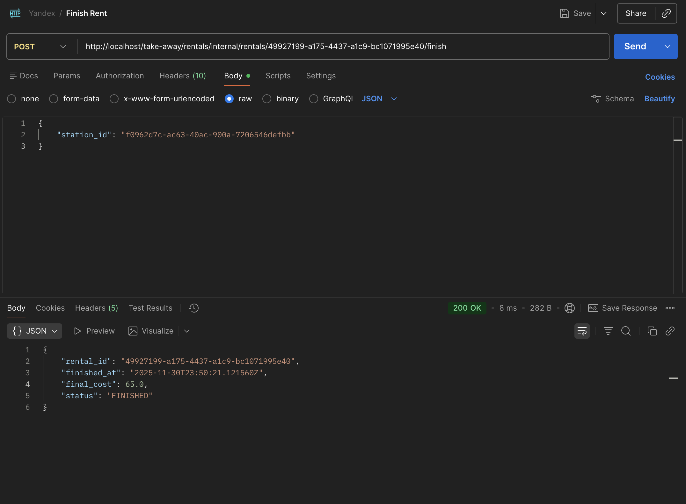

# Сценарий работы системы аренды пауэрбанков

## Шаг 1: Аутентификация

Пользователь открывает приложение и вводит email/пароль.

Что происходит:
- User Service проверяет учетные данные
- Возвращает JWT токен с информацией: ID пользователя, сегмент (обычный/премиум/VIP)
- Токен используется во всех последующих запросах

---

## Шаг 2: Создание оффера

Пользователь подходит к станции, сканирует QR-код, запрашивает стоимость аренды.

Что происходит:
- Запрос через API Gateway попадает в Offer & Pricing Service
- Сервис получает актуальную конфигурацию из Config Service (сколько живет оффер)
- Запрашивает тариф для станции из Tariff Service (с кэшированием на 10 минут)
- Может уточнить сегмент пользователя в User Service

Greedy Pricing: Если User Service недоступен — автоматически применяется максимальный тариф. Это защита от потери выручки.

- Создается оффер со "снимком" тарифа и временем жизни 5 минут
- Пользователь видит: "5 рублей в минуту, оффер действителен до 15:05"

---

## Шаг 3: Старт аренды

Пользователь нажимает "Взять пауэрбанк".

Что происходит:
- Запрос идет в Rental Command Service
- Сервис обращается к Offer Service: "Проверь и используй этот оффер"

Валидация оффера (атомарная операция):
- Проверяется: не истек ли оффер, принадлежит ли пользователю, не использован ли уже
- Оффер переводится из статуса ACTIVE в USED (защита от двойного использования)
- Возвращается "снимок" тарифа

Резервирование пауэрбанка:
- Вызывается Stations Service: "Выдай пауэрбанк на станции"
- Станция физически выдает устройство

Создание аренды:
- В одной транзакции создается запись об аренде с зафиксированным тарифом
- Записывается событие "аренда началась"

Если что-то пошло не так: Вся транзакция откатывается, пользователь видит ошибку, оффер остается доступным.

---

## Шаг 4: Проверка текущей стоимости (опционально)

Во время использования пользователь может открыть приложение и посмотреть "сколько накапало".

Что происходит:
- Rental Service находит аренду пользователя
- Рассчитывает текущую стоимость на основе зафиксированного тарифа и времени использования
- Возвращает: "Прошло 23 минуты, стоимость: 115 рублей"

Важно: Используется "снимок" тарифа из момента создания оффера — цена не изменится, даже если тарифы обновились.

---

## Шаг 5: Завершение аренды

Пользователь вставляет пауэрбанк в станцию (может быть другую) и завершает аренду.

Что происходит в одной транзакции:

1. Проверки: Rental Service проверяет, что это аренда пользователя и она активна

2. Возврат устройства: Вызывается Stations Service для приема пауэрбанка

3. Расчет стоимости: Вычисляется финальная сумма по фактическому времени использования

4. Сохранение результата: Аренда переводится в статус FINISHED с финальной стоимостью

5. Outbox для платежа: Создается запись в очередь на списание денег

Если что-то упало: Вся транзакция откатывается, аренда остается активной, деньги не списываются.

Пользователь видит: "Аренда завершена, стоимость: 155 рублей"

---

## Шаг 6: Списание денег (асинхронно, в фоне)

Payments Adapter периодически читает очередь на списание и обращается к Payments Service.

Зачем Outbox Pattern?
- Гарантирует, что платеж не потеряется
- Если платежный сервис недоступен — повторим позже
- Транзакционная согласованность: аренда и запрос на оплату создаются атомарно

---